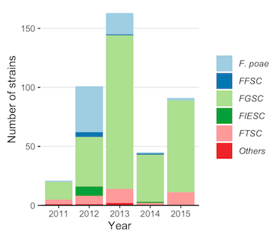

% About
 
This Research Compendium accompanies a manuscript entitled "Five-year survey uncovers extensive diversity and temporal fluctuations among Fusarium head blight pathogens of wheat and barley in Brazil". Link to Preprint here.

The work resulted from doctoral study conducted at the Universidade Estadual de Maringá in cooperation with Fundação Agrária de Pesquisa Agropecuária, Mycotoxin Prevention and Applied Microbiology Research Unit, ARS-USDA and Universidade Federal de Viçosa.

Authors, . Title of compendium. Online at https://doi.org/xxx/xxx

Licenses:  
Data: [CC-0](https://creativecommons.org/publicdomain/zero/1.0/) attribution requested in reuse
Code: [MIT](https://opensource.org/licenses/MIT) year: 2020, copyright holder: Emerson Del Ponte

